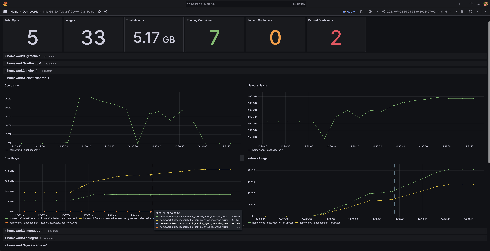
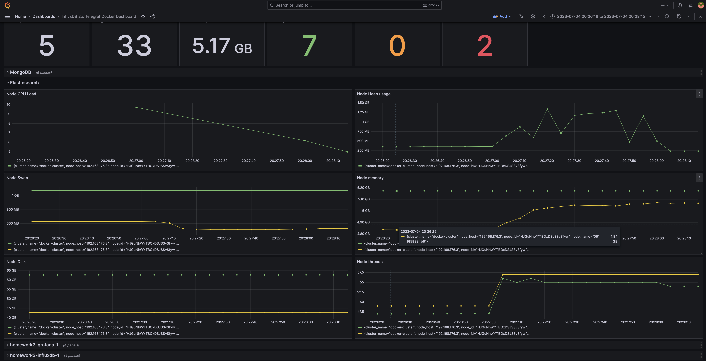
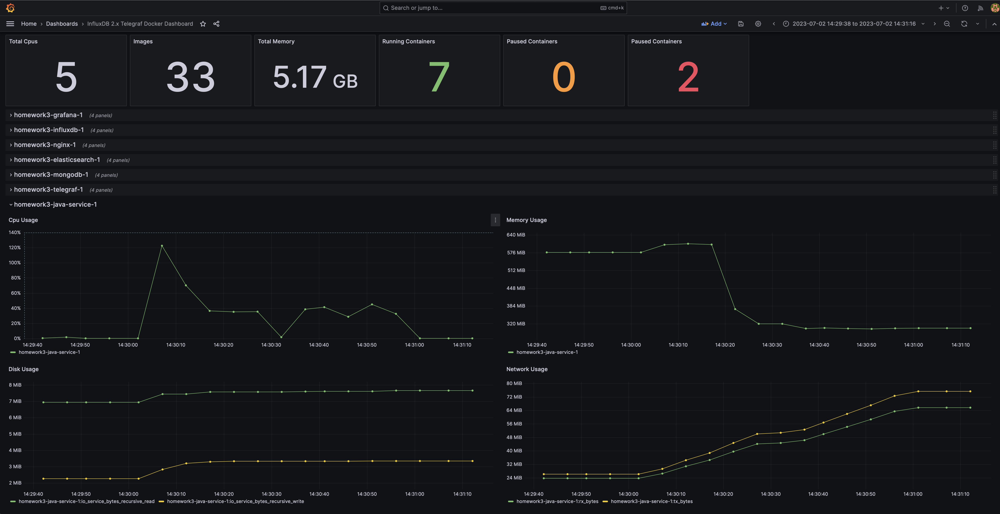
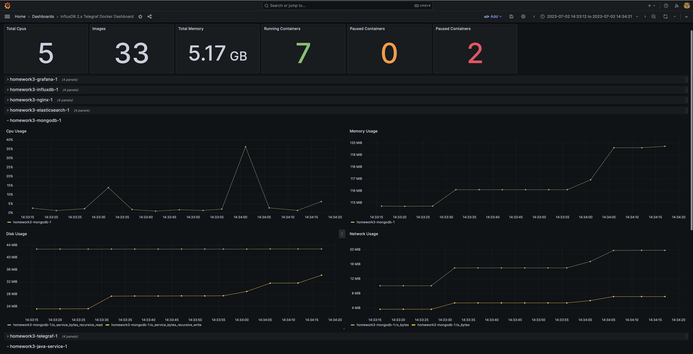
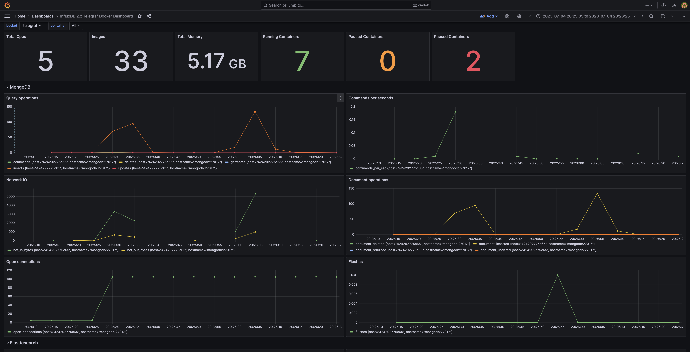
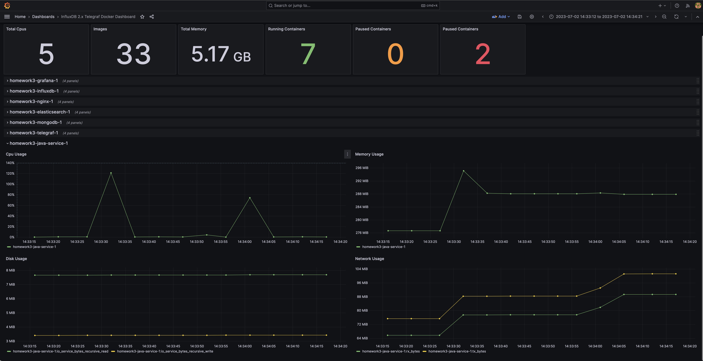

# Projector HSA Homework_3

## How to start services
```shell
docker compose up
```

## How to perform testing
```shell
./run_load_test_for_mongo.sh
./run_load_test_for_elastic.sh
```

## How to look at metrics
1. Go to Grafana UI `localhost:3000`
2. Select `InfluxDB 2.x Telegraf Docker Dashboard`
3. In the top of dashboard choose `bucket` -> `telegraf`
4. ???
5. PROFIT!

## Test results

---

`siege -c100 -t1M 'http://localhost:8888/elastic/trainer POST {}'`
```
Lifting the server siege...
Transactions:		       32695 hits
Availability:		      100.00 %
Elapsed time:		       60.43 secs
Data transferred:	        2.83 MB
Response time:		        0.17 secs
Transaction rate:	      541.04 trans/sec
Throughput:		        0.05 MB/sec
Concurrency:		       92.50
Successful transactions:       32695
Failed transactions:	           0
Longest transaction:	       13.44
Shortest transaction:	        0.00
```




---

`siege -c100 -t1M 'http://localhost:8888/mongodb/customer POST {}'`
```
Lifting the server siege...
Transactions:		       32810 hits
Availability:		       99.73 %
Elapsed time:		       60.78 secs
Data transferred:	        2.33 MB
Response time:		        0.06 secs
Transaction rate:	      539.82 trans/sec
Throughput:		        0.04 MB/sec
Concurrency:		       30.95
Successful transactions:       32810
Failed transactions:	          90
Longest transaction:	       19.54
Shortest transaction:	        0.00
```




---

## Service versions
| Service       | Version |
| ------------- | ------- |
| Ngnix         | 1.25.1  |
| Grafana       | 10.0.1  |
| InfluxDB      | 2.7     |
| Elasticsearch | 8.8.1   |
| MongoDB       | 6       |
| Telegraf      | 1.27    |

## Service endpoints
| Service      | Endpoint       |
| ------------ | -------------- |
| Ngnix        | localhost:8888 |
| Grafana UI   | localhost:3000 |
| InfluxDB UI  | localhost:8086 |
| Java Service | localhost:8080 |

## Service credentials
| Service      | User           | Password                 |
| ------------ | -------------- | ------------------------ |
| Grafana UI   | admin          | admin                    |
| InfluxDB UI  | admin          | passwordpasswordpassword |

## Test endpoints in java-service
```shell
curl -X POST localhost:8080/elastic/trainer
curl -X POST localhost:8080/mongodb/customer
```

## How to build docker image for java-service
This commands will compile project and build docker image locally:
```shell
cd java-service
./mvnw clean package docker:build
```