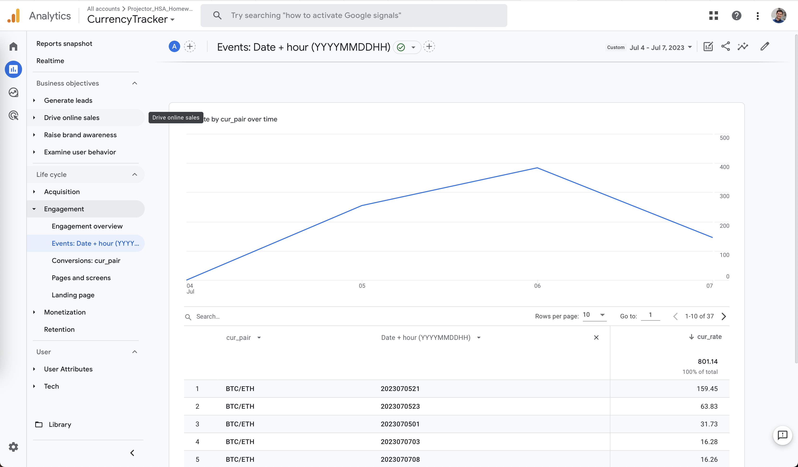

# Projector HSA Homework_4

## Currency change worker

Worker fetches the currency exchage rate data from `coin.api` and sends it to Google Analytics (as custom event) every hour.

Example of custom event for GA:
```json
{
    "client_id": "123",
    "events": [
        {
            "name": "currency_update",
            "params": {
                "time": "2023-07-04T22:07:39.0000000Z",
                "pair": "BTC/ETH",
                "rate": 15.865352967693445
            }
        }
    ]
}
```

## How to start worker

1. Create `.env` file with content (paste your values)
```
COIN_API_TOKEN=
COIN_API_ASSET_BASE=
COIN_API_ASSET_QUOTE=
GAMP_CLIENT_ID=
GAMP_API_SECRET=
GAMP_MEASUREMENT_ID=
```
2. Run docker container
```sh
docker run -d --env-file .env -p 8000:8000 nikit0s/projector-hsa-homework4
```

Dashboard with jobs accessible by url - `http://localhost:8000`

## How to build worker container
```sh
cd currency-worker
./mvnw clean package docker:build
```

----------

## Looking at the data in Google Analytics

### Custome event mapping

| JSON field | GA custom definition | GA Type   |
| ---------- | -------------------- | --------- |
| pair       | cur_pair             | dimension |
| time       | cur_time             | dimension |
| rate       | cur_rate             | metric    |
|            |                      |           |

### 1. Through Engagement -> Events tab

Here we can look only for aggragated data by day:


### 2. Through Explotation tab

Here we can create custom view with hour granularity, but the visualisation isn't suitable for currencies


### 3. Through Looker studio

Here we can create custom view with hour granularity and have a decent visualization
