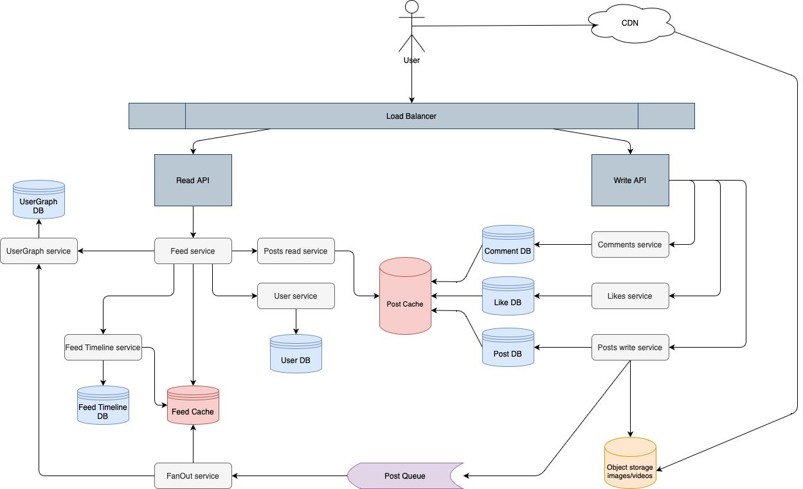

# Projector HSA Homework_7 (Design Instagram)

## Requirements

### Functional requiremnets
 - Post photos and videos
 - Like and coment posts
 - Generate newsfeed

### Resource estimation

 - 2 billion users overall
 - 1 billion daily active users
 - 500 million photos shared per day
 - 100 million videos shared per day
 - 1 photo weight 5Mb
 - 1 video for 1 minute weight 150Mb

## API

### Upload photo/video for post
 - `POST /post/{postId}/{mediaType}/upload`

### Like post
 - `POST /post/{postId}/like`

### Comment post
 - `POST /post/{postId}/comment`

### Get newsfeed
 - `GET /me/feed`

## High-level architecture

## Database choise
 - Key-Value DB for cache
 - NoSql DB for Feed Timeline, Post, Like and Comment DB
 - Graph DB for UserGraph DB
 - Relational DB for User DB

## Usecases

### Create new post/like/comment

Each request handles by a separate service that writes to its own db. Additionally `Post service` will write image/video to object storage and store link into its own db. Also `Post service` will write post events to `Post queue`. `Fanout service` will read events and add them to users feeds. Users feeds live inside `Feed cache` in the form of `(user_id, list_of_post_ids, last_updated_timestamp)`
This `Feed cache` will periodically be dumped to `Feed Timeline DB` by `Feed Timeline service`

### Get newsfeed
The request goes to `Feed service` that queries `User Graph service` to get a list of followed users. 
 - For "regular user": it will retrieve feed from `Feed Cache` if requested timestamp is not in the cache it will retrieve posts from `Feed Timeline service`
 - For "celebrity user" it will retrieve data from `Post service` and merge it with the feed for "regular users".
Then it calls `User service` to get info about users, like names, avatars, etc.
When a response from `Feed service` returns to the user's device it will retrieve images or videos from CDN that behave like a cache for object storage.

### Single point of failure

Each service should be run in multiple instances and every database should be replicated and sharded. However this is a read-heavy system, so we need to pay attention to `Feed service`, `User Graph service`, `User Graph DB`, and `Feed cache` because if they are down - users will see nothing in their feeds. Yes, if other services are down it will see only 10-20 recent posts, but it is still something.

